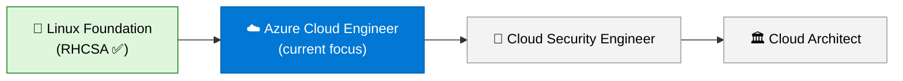

# Hi, I'm Shaun Walker 👋

### Aspiring Azure Cloud Engineer | RHCSA Certified

I'm breaking into tech with a clear target: **Azure cloud engineering**, then **cloud security**, then **cloud architecture**. I earned my Red Hat Certified System Administrator (RHCSA) certification to build a strong Linux foundation, and now I'm building hands-on Azure experience one lab at a time. Everything I learn is documented here with written guides, screenshots, and **Loom video walkthroughs** where I explain each project out loud, mistakes included.

---

## 🧭 The Path

| Stage | Focus | Status |
|---|---|---|
| **1. Linux Foundation** | Enterprise Linux administration, earned through the RHCSA | ✅ Certified |
| **2. Azure Cloud Engineer** | Resource management, networking, storage, Infrastructure as Code, governance | 🔵 Actively building |
| **3. Cloud Security Engineer** | Identity and access, policy, monitoring, hardening | ⚪ Next big step |
| **4. Cloud Architect** | Designing secure, resilient, cost-aware systems at scale | ⚪ Long-term goal |

I also have a long-term interest in **OT/ICS security**, where cloud, Linux, and critical infrastructure meet.

---

## 🐧 Why Start With Linux?

Most cloud workloads run on Linux. Understanding how the operating system handles permissions, storage, networking, and services makes cloud concepts click faster, because Azure is largely those same ideas delivered as managed services. My RHCSA gives me that foundation, and my labs show I can build on it.

---

## 🔭 What I'm Working On

- ☁️ **Azure hands-on labs:** resource groups, storage, static hosting, and clean-up habits
- 🏗️ **Infrastructure as Code** with Terraform
- 🛡️ **Cloud governance:** RBAC, Azure Policy, and cost management
- 🐧 **Linux homelab:** keeping my RHCSA skills sharp on Rocky Linux and RHEL
- 📝 **Documenting in public:** every lab gets a write-up, screenshots, lessons learned, and a Loom video walkthrough

---

## 📂 Featured Projects

| Project | What it shows | Video walkthrough |
|---|---|---|
| [**Azure Cloud Labs**](https://github.com/ShaunWalker-tech/Azure-cloud-labs) | Step-by-step Azure labs with architecture diagrams, screenshots, and notes. Starts with a static website on Blob Storage. | 🎬 Coming soon |

### 🎥 Why the videos?

Building something is one skill; explaining it clearly is another. For each project I record a short Loom walkthrough covering **what I built, why I made each choice, and what went wrong along the way**. It keeps me honest about what I actually understand, and it's the same skill I'll need in interviews and on a team.

---

## 🛠️ Toolbox

**Linux skills:** user and group management · file permissions and ACLs · storage and LVM · networking · firewalld · SELinux · NFS and AutoFS · Apache · Podman containers

---

## 🏆 Certifications

| Certification | Status |
|---|---|
| Red Hat Certified System Administrator (RHCSA) | ✅ Earned |
| Microsoft Azure Administrator (AZ-104) | 🎯 Planned |
| CompTIA Security+ | 🎯 Planned |

---

## 🎯 Goals

- **Short term:** build a strong portfolio of Azure labs and earn my first Azure certification
- **Mid term:** land my first cloud engineering role
- **Long term:** grow into Cloud Security Engineer, then Cloud Architect

---

## 📫 Let's Connect

I'm always happy to talk cloud, Linux, or career paths with others on the same road.

*Building in public, one lab at a time.* ☁️
